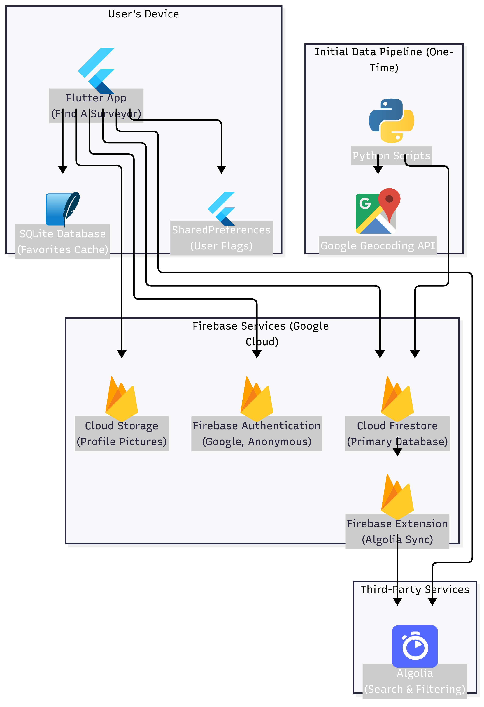

# Find A Surveyor

The definitive, modern directory for finding and verifying IRDAI-licensed insurance surveyors across India.

## Overview

**Find A Surveyor** is a cross-platform mobile application built with Flutter that solves a critical problem in the Indian insurance ecosystem. It takes the publicly available but difficult-to-use data from the Insurance Regulatory and Development Authority of India (IRDAI) and transforms it into a fast, user-friendly, and feature-rich directory.

The app serves two primary audiences:

- **The General Public**: Individuals, business owners, and legal professionals who need to quickly find a qualified surveyor for an insurance claim.
- **Insurance Surveyors**: The professionals themselves, who can claim, verify, and enrich their profiles to connect with new clients.

This repository contains the complete source code for the Flutter application and the associated backend data processing scripts.

## Key Features

- ⚡ **Powerful Search**: An instant, typo-tolerant search powered by Algolia allows users to find surveyors by name, city, state, or pincode.
- 🗺️ **"Near Me" Functionality**: A map-based view (`google_maps_flutter`) that uses the device's location (`geolocator`) and Firestore's geo-query capabilities (`geoflutterfire_plus`) to display nearby surveyors.
- ⚙️ **Advanced Filtering**: A clean, modal-based UI allows users to filter the directory by State, City, Department (e.g., Motor, Fire), and IIISLA Level (e.g., Fellow, Associate).
- ✅ **Verified Profiles**: A robust "Claim Profile" system allows surveyors to verify their identity via OTP. Claimed profiles are marked with a verified badge, providing a strong trust signal to users.
- ✏️ **Profile Enrichment**: Verified surveyors can update their profiles with a professional bio, a profile picture, a list of empaneled insurance companies, and additional contact information.
- ⭐ **Offline Favorites**: Users can save their favorite surveyors to a local SQLite database for quick, offline access.
- ☁️ **Cloud Sync**: For registered users, favorites are automatically synced to their account in Firestore, making them available across all devices.
- 🛡️ **Secure Authentication**: A clean login screen with multiple providers (Google Sign-In, Anonymous "Skip" Login) managed by Firebase Authentication and a `go_router`-based redirect system.

## Tech Stack & Architecture



### Frontend (Flutter)

- **State Management**: `provider` for dependency injection of services.
- **Navigation**: `go_router` for a centralized, URL-based routing system that handles deep linking and authentication state.
- **Local Database**: `sqflite` for a persistent, offline cache for user favorites.
- **Secret Management**: `envied` for securely managing API keys (Algolia, Google Maps) and keeping them out of version control.
- **User Feedback**: `in_app_review` for native review prompts and feedback for collecting user comments and screenshots.
- **Update Prompts**: `upgrader` for automatically notifying users of new app versions.

### Backend (Serverless)

- **Primary Database**: Cloud Firestore serves as the single source of truth for all surveyor, user, and application data.
- **Search & Filtering Engine**: Algolia is used to provide a powerful, typo-tolerant search and faceting experience.
- **Data Sync**: The official Firebase Extension for Algolia automatically keeps the search index in sync with the Firestore database.
- **Authentication**: Firebase Authentication handles all user sign-in, account linking, and identity verification.
- **File Storage**: Firebase Cloud Storage is used for storing user-uploaded profile pictures.
- **Monitoring**: Firebase Crashlytics and Google Analytics are integrated for robust crash reporting and user behavior analysis.

### Data Pipeline (Python)

A collection of Python scripts is used for the initial data processing and enrichment:

- Combines and cleans raw data from multiple sources.
- Uses the Google Geocoding API to get coordinates and `pygeohash` to generate geohashes.
- Enriches the data with IIISLA membership levels and professional ranks.
- Generates optimized `search_keywords` and `filter_keys` arrays for Firestore and Algolia.
- Uploads the final, structured data to Firestore in secure batches.

## Getting Started

### Clone the repository:

```bash
git clone https://github.com/your-username/find-a-surveyor.git
cd find-a-surveyor
```

### Set up Firebase:

- Create a new Firebase project.
- Run `flutterfire configure` to generate your `firebase_options.dart` file.
- Download your `serviceAccountKey.json` for the Python scripts.
- Enable Firestore, Authentication (Google), Storage, and Crashlytics.

### Set up Secrets:

Create a `.env` file in the root of the project and add:

```
ALGOLIA_APP_ID=your_app_id
ALGOLIA_API_KEY=your_api_key
GOOGLE_MAPS_API_KEY=your_maps_key
```

### Install Dependencies:

```bash
flutter pub get
```

### Run the App:

```bash
flutter run
```

## License

This is a proprietary project. The code is not licensed for reuse or distribution without explicit permission.
